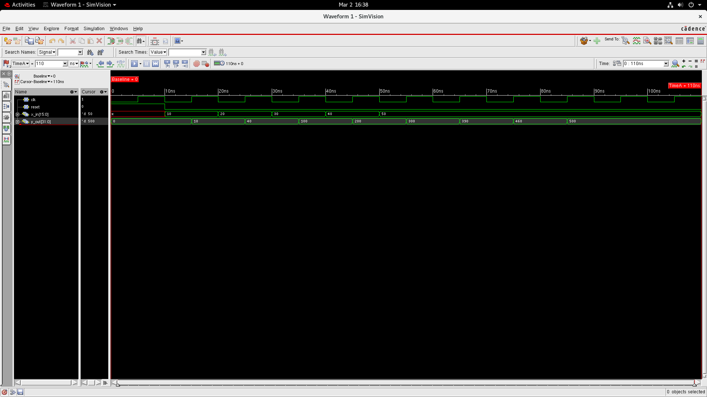
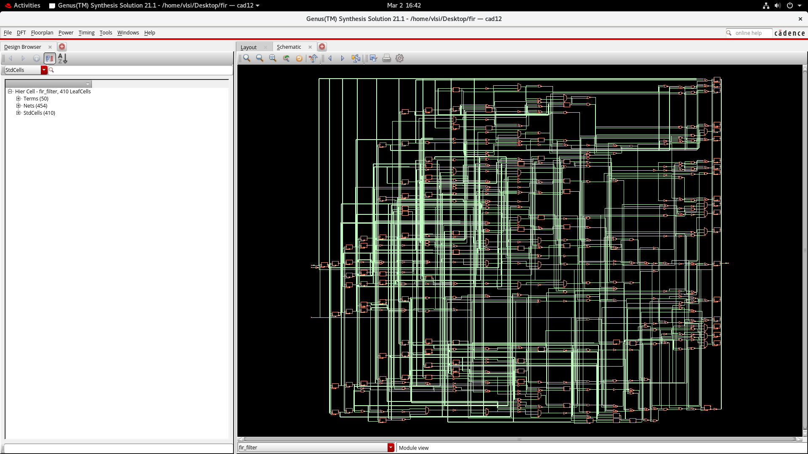

# DIGITAL-FILTER-DESIGN

**COMPANY:** CODTECH IT SOLUTIONS

**NAME:** Mallikarjun S G 

**INTERN ID:** CTIS5769

**DOMAIN:** VLSI  

**DURATION:** 4 Weeks 

**MENTOR:** Neela Santosh 

---

## 📌 Project Overview

This project presents the design and simulation of a Digital FIR (Finite Impulse Response) Filter using Verilog Hardware Description Language (HDL). FIR filters are widely used in digital signal processing systems to remove noise and improve signal quality.

The FIR filter processes input samples and produces a filtered output by computing the weighted sum of the current input sample and several previous input samples. The design uses delay elements, multipliers, and adders to implement the filter structure.

The filter operation is verified through simulation waveforms, and the design is synthesized using Cadence Genus to analyze hardware performance parameters such as power consumption, timing, and area utilization.

---

## 🎯 Objective

- Design a Digital FIR Filter using Verilog HDL

- Implement filtering operation using delay elements and filter coefficients

- Verify functionality using simulation waveform

- Perform synthesis and analyze hardware performance metrics

---

## ⚙️ Tools Used

- Verilog HDL

- Cadence Genus

- SimVision

---

## 💻 Source Code
### 🔹 FIR Filter Design (filter.v)

Implements the FIR filter architecture using delay registers, multipliers, and adders. The module processes input samples and generates the filtered output based on predefined filter coefficients.

### 🔹 Testbench (filter_tb.v)

Applies different input samples to verify the functionality of the FIR filter and generates simulation waveforms to observe the filtering operation.

Source files are available in the Source_Code folder.

### 🧮 FIR Filter Tap Operations

|Tap	    |       Operation       |
| x[n]	  |  Current input sample |
| x[n-1]	|  First delayed input  |
| x[n-2]	|  Second delayed input |
| x[n-3]	|  Third delayed input  |

---

## 🖥 Simulation Output

The waveform verifies the correct behavior of the FIR filter and shows how input samples propagate through delay elements to generate the filtered output.

---

## 🔧 RTL Schematic

The RTL schematic shows the synthesized hardware structure generated from the Verilog FIR filter design.

---

## 📊 Synthesis Reports

Power, timing, area, and gate-level synthesis reports are available in the Synthesis_Reports folder.

---

## 📄 Project Report

📥 **Download Full Report:** 

[FIR Filter Report (PDF)](Project_Report/Fir_Filter_Report.pdf)

---

## ✅ Results

Simulation results confirm correct filtering operation for the applied input samples. The waveform analysis shows the propagation of input signals through delay elements and the generation of filtered output using filter coefficients. Synthesis results indicate efficient hardware implementation with acceptable power consumption, timing performance, and area utilization.
